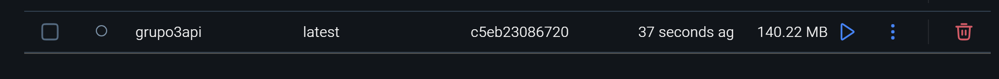
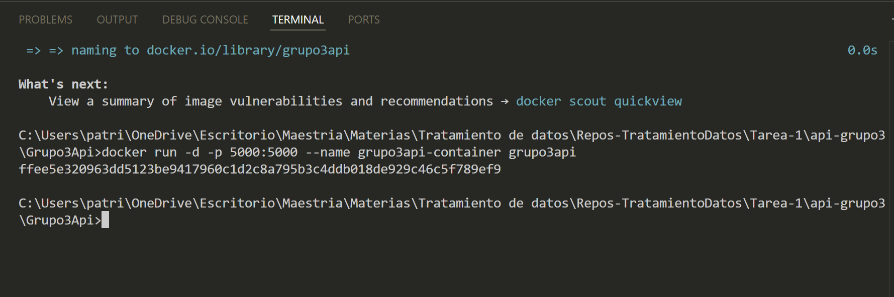
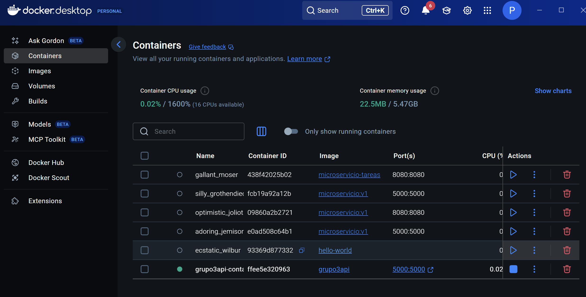
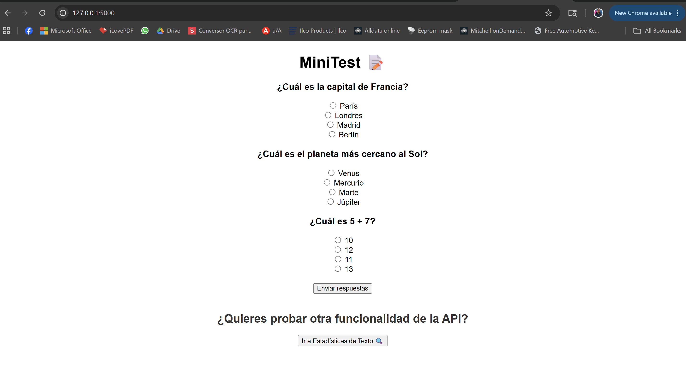
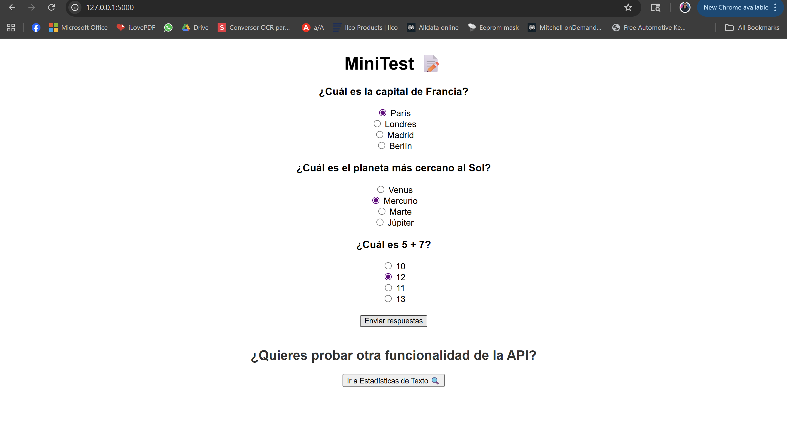
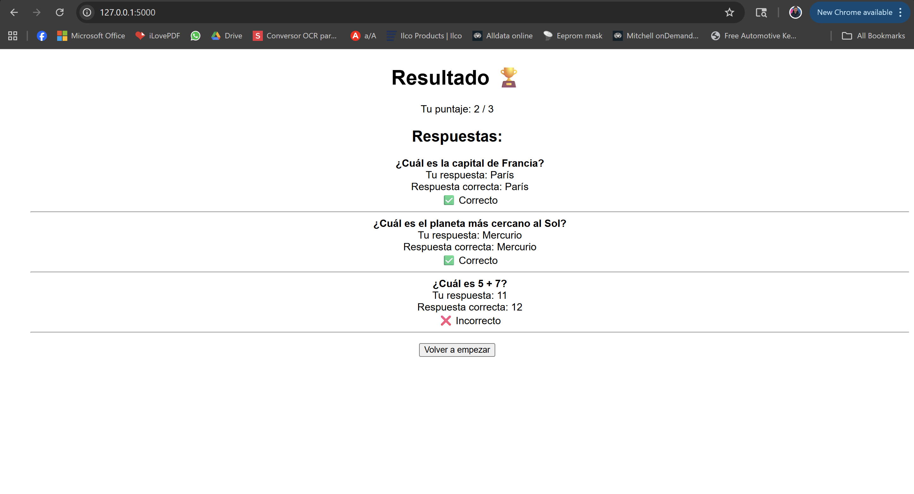
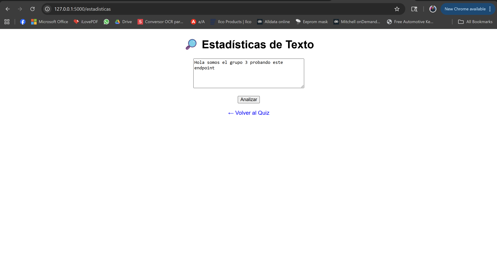
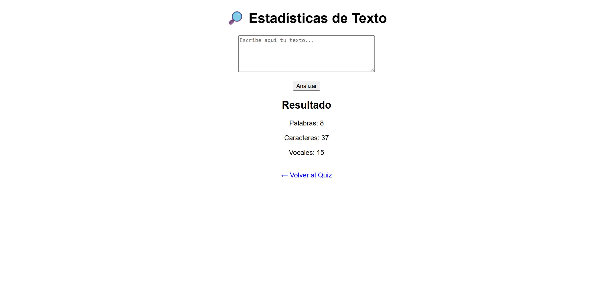

# 📖 Proyecto: Mini Quiz + Analizador de Texto

Este proyecto es una **API web desarrollada con Flask y dockerizada**, cuyo objetivo principal es demostrar la creación de endpoints básicos y su integración con interfaces HTML.

---

## ⚙️ Funcionalidades principales

### 1️⃣ Mini Quiz Interactivo
- Presenta al usuario un cuestionario de 3 preguntas con opciones múltiples.  
- Al enviar sus respuestas, el sistema calcula el puntaje y muestra un resumen indicando cuáles respuestas fueron correctas o incorrectas.  
- Esta lógica está implementada en el archivo **`app.py`** y se apoya en las plantillas **`index.html`** y **`resultado.html`**.  

### 2️⃣ Analizador de Texto (`/estadisticas`)
- Permite al usuario ingresar un texto y obtener estadísticas simples: número de palabras, número de caracteres y número de vocales.  
- Cuenta con una interfaz propia (**`estadisticas.html`**) y un acceso directo desde la página principal del proyecto.  
- Está pensado como un ejemplo práctico de cómo añadir nuevas rutas y funcionalidades a una API existente.  

---

## 🐳 Ejecución con Docker

El proyecto está contenedorizado con Docker, lo que permite ejecutarlo de forma sencilla en cualquier entorno sin necesidad de configuraciones manuales complejas.

### 🔨 Creación de la Imagen

### ▶️ Corriendo el Contenedor
  

---

## 🚀 Ejecutando la API

### Pantalla Principal (Mini Quiz)

### Selección de Respuestas

### Resultado del Quiz

### Analizador de Texto (`/estadisticas`)

### Resultado del Análisis

